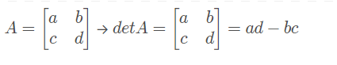

# Matrizes
Resolução dos exercícios propostos na aula de Estruturas Matemáticas pelo professor Antônio Leaes.
Foi solicitado para `não utilizar bibliotecas e funções do python.`

# Funções utilizadas

## Determinante
### Matriz de ordem 2

```python
elif self.lines == 2:
    return self.matrix[0][0] * self.matrix[1][1] - self.matrix[0][1] * self.matrix[1][0]
```
### Matriz de ordem 3


```python
elif self.lines == 3 :
    dig_sec = (self.matrix[0][2] * self.matrix[1][1] * self.matrix[2][0]) + (self.matrix[0][0] * self.matrix[1][2] * self.matrix[2][1]) + (self.matrix[0][1] * self.matrix[1][0] * self.matrix[2][2])
    dig_pri = (self.matrix[0][0] * self.matrix[1][1] * self.matrix[2][2]) + (self.matrix[0][1] * self.matrix[1][2] * self.matrix[2][0]) + (self.matrix[0][2] * self.matrix[1][0] * self.matrix[2][1])
    return dig_pri - dig_sec
```

### Matrizes de ordem superior (Teorema de Laplace)


```python
else:
    matrix_line = self.matrix[0]
    cofactors = []

    for i in range(self.lines):
        cofactor = self.get_cofactor(0, i)
        cofactors.append(cofactor)
    result = 0

    for i in range(self.lines):
        result += matrix_line[i] * cofactors[i]

    return result
```
Escolher uma linha (neste caso a primeira [0]) e para cada elemento dela multiplicar pelo seu cofator e somar cada um dos resultados


## Cofator

#### Traduzido para código:
```python
def get_cofactor(self, line, colune):
        sub_matrix = Matrix(self.lines - 1, self.colunes - 1)
        matrix = []
        for i in range(self.lines):
            lines = []
            for j in range(self.colunes):
                if i != line and j != colune:
                    number = self.matrix[i][j]
                    lines.append(number)
            if lines != []:
                matrix.append(lines)
        if matrix != []:
            sub_matrix.set(matrix)

        sub_determinant = sub_matrix.get_determinant()
        cofactor = ((-1)**(line + colune)) * sub_determinant

        return cofactor
```

A função pega a linha e a coluna do elemento que é desejado calcular o cofator e cria uma submatriz quadrada reduzida para achar o determinante dessa elemento.

Para criar essa submatriz é chamado o próprio objeto e adicionado em loop todos os elementos que não estão na linha nem coluna do elemento 
```python
if i != line and j != colune:
```

É chamado a própria função do objeto `get_determinant(self)` para calcular a determinante do `menor complementar`, que é multiplicada por -1 elevado à linha e coluna correspondente desse elemento.

```python
sub_determinant = sub_matrix.get_determinant()
cofactor = ((-1)**(line + colune)) * sub_determinant
```

## Matriz de Cofatores
#### Código:
```python
def get_cofactor_matrix(self):
    cofactor_matrix = Matrix(self.lines,self.colunes)
    for i in range(self.lines):
        for j in range(self.colunes):
            number = self.get_cofactor(i,j)
            cofactor_matrix.set_value(number, i, j)
    return cofactor_matrix
```
Um novo objeto da Matrix é criado para armazenaar essa nova Matrix
Realizado um loop bidimensional para iterar entre esses elementos para cada um deles é realizado o seu cofator e armazenado na nova Matrix

## Matriz adjunta
A matriz adjunta é a matriz de cofatores transposta
#### Traduzido para código:
```python
adjunt_matrix = self.get_cofactor_matrix().get_transposed().get()
```


## Matriz inversa


A matriz inversa é a sua matriz adjunta dividida pelo determinante para cada um dos seus elementos

#### Traduzido para código:
```python
def get_inverted(self):
    determinant = self.get_determinant()
    if  determinant != 0:
        inverted_matrix = Matrix(self.lines, self.colunes)
        adjunt_matrix = self.get_cofactor_matrix().get_transposed().get()
        for i in range(self.lines):
            for j in range(self.colunes):
                number = adjunt_matrix[i][j] / self.get_determinant()
                inverted_matrix.set_value(number,i,j)
        return inverted_matrix
```


